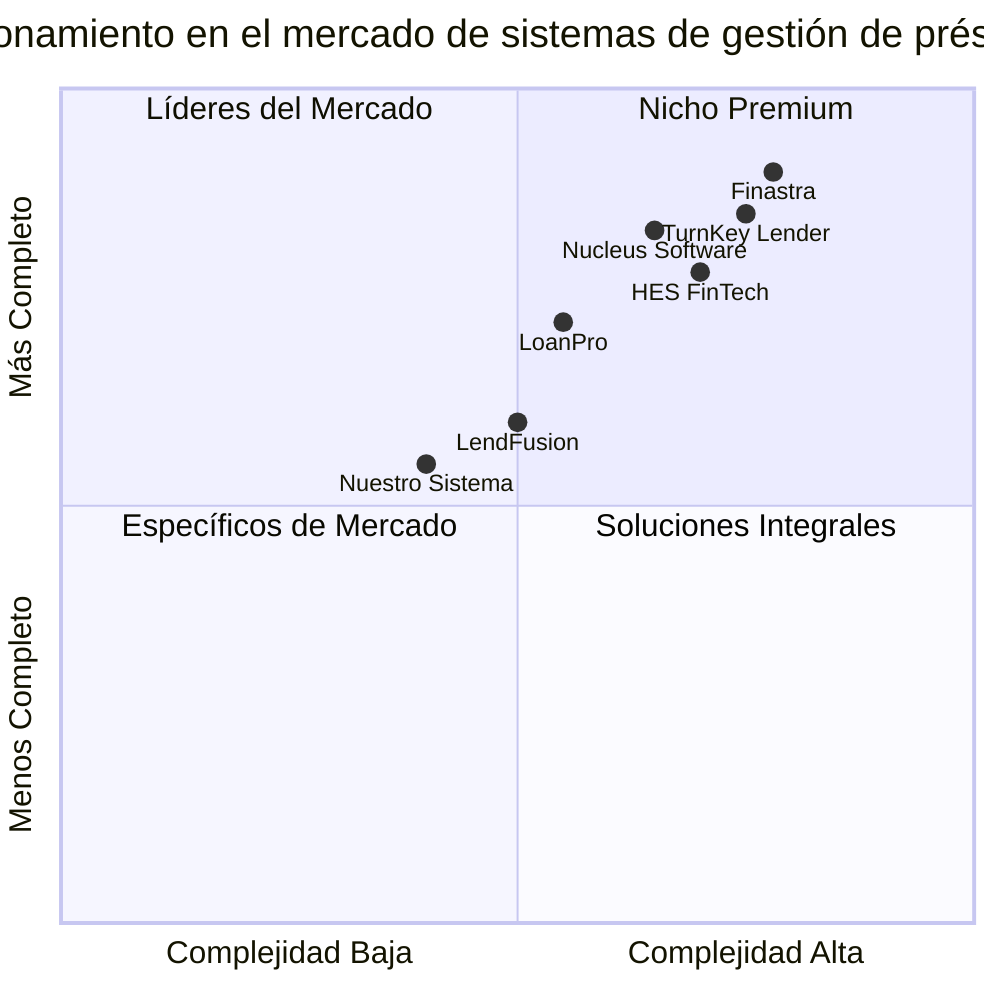

# Product Requirements Document (PRD)
# Sistema de Gestión de Préstamos (Loan Management System)

## Información del Proyecto
- Lenguaje: Español
- Tecnologías: React, JavaScript, Tailwind CSS
- Nombre del Proyecto: sistema_gestion_prestamos
- Requisitos Originales: Sistema web para la administración de préstamos, que permita a administradores gestionar préstamos eficientemente, a clientes consultar su estado de préstamos e historial de pagos, y a empleados registrar clientes y manejar solicitudes de préstamos.

## Definición del Producto

### Objetivos del Producto
1. **Mejorar la Eficiencia Administrativa**: Automatizar procesos manuales de gestión de préstamos para reducir errores y tiempo de procesamiento.
2. **Potenciar la Transparencia con Clientes**: Proporcionar a los clientes acceso directo a la información de sus préstamos y pagos para mejorar la satisfacción del cliente.
3. **Optimizar la Toma de Decisiones**: Proporcionar análisis y estadísticas sobre préstamos y pagos para facilitar decisiones comerciales informadas.

### Historias de Usuario

1. **Como administrador**, quiero tener una vista completa de todos los préstamos activos, pendientes y cerrados para poder monitorear eficazmente la cartera de préstamos.

2. **Como cliente**, quiero ver el estado actual de mis préstamos, incluyendo el monto restante, próximas fechas de pago y opciones de pago disponibles, para poder planificar mis finanzas.

3. **Como empleado**, quiero poder registrar nuevos clientes y procesar solicitudes de préstamos de manera eficiente para proporcionar un servicio rápido y confiable.

4. **Como administrador**, quiero acceder a un calendario visual de pagos con codificación de colores para identificar rápidamente pagos atrasados, próximos y completados.

5. **Como cliente**, quiero recibir notificaciones sobre próximos pagos y confirmaciones de pagos realizados para mantenerme al día con mis obligaciones.

### Análisis Competitivo

| Producto | Pros | Contras |
|----------|------|--------|
| **TurnKey Lender** | - Automatización completa del proceso de préstamos<br>- Decisiones basadas en IA<br>- Amplia integración (75+ sistemas) | - Precio elevado<br>- Complejidad para negocios pequeños<br>- Curva de aprendizaje pronunciada |
| **LendFusion** | - Motor de decisiones robusto<br>- Portal de cliente intuitivo<br>- Precios competitivos | - Funcionalidades limitadas para préstamos especializados<br>- Actualizaciones menos frecuentes<br>- Soporte técnico con tiempos de respuesta variables |
| **HES FinTech** | - Implementación rápida (3-4 meses)<br>- Soporte de por vida<br>- Alta flexibilidad | - Enfoque en instituciones financieras mayores<br>- Costo elevado para empresas pequeñas<br>- Personalización compleja |
| **Nucleus Software** | - Experiencia global comprobada<br>- Soluciones para préstamos corporativos y minoristas<br>- Escalabilidad | - Interfaz de usuario antigua<br>- Proceso de implementación largo<br>- Sistema menos ágil para cambios |
| **Finastra** | - Amplia gama de soluciones de préstamo<br>- Presencia global establecida<br>- Integraciones extensas | - Orientado principalmente a grandes instituciones<br>- Alto costo<br>- Menor agilidad para adaptaciones |
| **LoanPro** | - Enfoque en configuración<br>- Especializado en servicio de préstamos<br>- Altamente personalizable | - Menos enfocado en originación de préstamos<br>- Interfaz de usuario puede ser confusa<br>- Recursos de capacitación limitados |
| **Nuestro Sistema** | - Interfaz intuitiva y moderna<br>- Calendario de pagos visual con codificación de colores<br>- Cálculos automatizados de deuda e interés<br>- Portales específicos para cada rol | - Nuevo en el mercado<br>- Funcionalidades iniciales limitadas<br>- Sin presencia establecida |

### Cuadrante Competitivo



## Especificaciones Técnicas

### Análisis de Requisitos

El sistema de gestión de préstamos requiere una aplicación web moderna, robusta y segura que proporcione funcionalidades específicas para tres tipos de usuarios: administradores, empleados y clientes. La interfaz debe ser intuitiva, responsive y proporcionar cálculos automáticos precisos de deudas e intereses. Un componente clave será el calendario de pagos con codificación de colores para facilitar el seguimiento de pagos.

### Módulos del Sistema

#### 1. Panel de Administrador
- **Gestión de usuarios**: Crear, editar, desactivar cuentas de empleados y clientes
- **Gestión global de préstamos**: Visualización y administración de todos los préstamos
- **Reportes y estadísticas**: Análisis de cartera, morosidad, rentabilidad
- **Configuración del sistema**: Parámetros de préstamos, tasas de interés, plazo máximo

#### 2. Portal de Cliente
- **Perfil de usuario**: Información personal y financiera
- **Estado de préstamos**: Visualización de préstamos activos, historial, balances
- **Historial de pagos**: Registro completo de transacciones realizadas
- **Próximos pagos**: Notificaciones y fechas de vencimiento
- **Simulador de préstamos**: Cálculo de cuotas según monto, plazo e interés

#### 3. Portal de Empleado
- **Registro de clientes**: Captura de información personal y financiera
- **Solicitud de préstamos**: Procesamiento y aprobación inicial
- **Seguimiento de clientes**: Historial de interacciones y préstamos
- **Gestión de pagos**: Registro y procesamiento de pagos recibidos

#### 4. Calendario de Pagos
- **Vista mensual/semanal**: Visualización de pagos programados
- **Codificación por colores**: Verde (pagado), Amarillo (próximo), Rojo (atrasado)
- **Notificaciones automáticas**: Alertas de vencimientos próximos
- **Filtros y búsquedas**: Por cliente, estado, fechas

#### 5. Cálculos Automatizados
- **Cálculo de intereses**: Diferentes métodos (fijo, compuesto, etc.)
- **Amortización de préstamos**: Tablas de amortización detalladas
- **Penalizaciones automáticas**: Cálculo de recargos por pagos tardíos
- **Proyecciones financieras**: Estimaciones de ingresos futuros

### Pool de Requisitos

#### Requisitos P0 (Imprescindibles)
1. **DEBE** implementar autenticación segura con diferentes roles de usuario (administrador, empleado, cliente)
2. **DEBE** permitir a los administradores gestionar usuarios y préstamos de forma integral
3. **DEBE** permitir a los clientes visualizar el estado actual de sus préstamos y pagos realizados
4. **DEBE** permitir a los empleados registrar nuevos clientes y procesar solicitudes de préstamos
5. **DEBE** calcular automáticamente intereses, balances y fechas de pago
6. **DEBE** implementar un calendario visual de pagos con codificación de colores
7. **DEBE** almacenar y proteger adecuadamente todos los datos personales y financieros

#### Requisitos P1 (Importantes)
1. **DEBERÍA** permitir múltiples métodos de cálculo de interés (simple, compuesto, etc.)
2. **DEBERÍA** generar notificaciones automáticas para pagos próximos y vencidos
3. **DEBERÍA** ofrecer reportes estadísticos sobre el estado de la cartera de préstamos
4. **DEBERÍA** permitir la configuración de diferentes tipos de préstamos con parámetros específicos
5. **DEBERÍA** incluir un panel de control visual con métricas clave para administradores

#### Requisitos P2 (Deseables)
1. **PUEDE** implementar un simulador de préstamos para clientes potenciales
2. **PUEDE** ofrecer integración con sistemas de pago en línea
3. **PUEDE** implementar un sistema de mensajería interna entre usuarios
4. **PUEDE** generar documentos PDF de contratos y recibos de pago
5. **PUEDE** ofrecer una aplicación móvil complementaria para clientes

### Diseño de Interfaz de Usuario

A continuación se presenta un bosquejo general de las principales pantallas del sistema.

#### Panel de Administrador
```
+------------------------------------------------------------+
|  LOGO   | Dashboard | Préstamos | Clientes | Reportes | Config |
+------------------------------------------------------------+
|                                                            |
|  +---------------------+        +----------------------+   |
|  | PRÉSTAMOS ACTIVOS   |        | PAGOS HOY           |   |
|  | 125                 |        | 18                  |   |
|  +---------------------+        +----------------------+   |
|                                                            |
|  +---------------------+        +----------------------+   |
|  | PRÉSTAMOS VENCIDOS  |        | INGRESOS ESTE MES   |   |
|  | 8                   |        | $24,500             |   |
|  +---------------------+        +----------------------+   |
|                                                            |
|  +--------------------------------------------------+     |
|  |                PRÉSTAMOS RECIENTES                |     |
|  | Cliente | Monto | Fecha | Estado | Interés | Acciones  |
|  | -------- | ----- | ----- | ------ | ------- | -------- |
|  | Carlos G | $5000 | 01/04 | Activo | 2.5%    | Ver/Edit |
|  | María L  | $3000 | 28/03 | Activo | 2.5%    | Ver/Edit |
|  | Juan P   | $7500 | 25/03 | Retraso| 2.5%    | Ver/Edit |
|  +--------------------------------------------------+     |
|                                                            |
+------------------------------------------------------------+
```

#### Portal de Cliente
```
+------------------------------------------------------------+
|  LOGO   | Mis Préstamos | Pagos | Perfil | Simulador         |
+------------------------------------------------------------+
|                                                            |
|  +--------------------------------------------------+     |
|  |                MIS PRÉSTAMOS ACTIVOS              |     |
|  +--------------------------------------------------+     |
|                                                            |
|  +---------------------+        +----------------------+   |
|  | PRÉSTAMO #12458     |        | PRÓXIMO PAGO        |   |
|  | Monto: $5,000       |        | 15/04/2025         |   |
|  | Fecha: 01/01/2025   |        | Monto: $450         |   |
|  | Plazo: 12 meses     |        |                      |   |
|  | Interés: 2.5%       |        |                      |   |
|  +---------------------+        +----------------------+   |
|                                                            |
|  +--------------------------------------------------+     |
|  |                 HISTORIAL DE PAGOS                |     |
|  | Fecha    | Monto  | Concepto        | Estado     |     |
|  | -------- | ------ | --------------- | ---------- |     |
|  | 15/03/25 | $450   | Cuota #3        | Completado |     |
|  | 15/02/25 | $450   | Cuota #2        | Completado |     |
|  | 15/01/25 | $450   | Cuota #1        | Completado |     |
|  +--------------------------------------------------+     |
|                                                            |
+------------------------------------------------------------+
```

#### Calendario de Pagos
```
+------------------------------------------------------------+
|  LOGO   | Dashboard | Préstamos | Clientes | Calendario |     |
+------------------------------------------------------------+
|                                                            |
|  +--------------------------------------------------+     |
|  |     CALENDARIO DE PAGOS - ABRIL 2025             |     |
|  +--------------------------------------------------+     |
|                                                            |
|  | Dom | Lun | Mar | Mié | Jue | Vie | Sáb |             |
|  |-----|-----|-----|-----|-----|-----|-----|             |
|  |     |     |     | 1   | 2   | 3   | 4   |             |
|  |     |     |     |     |[Y]2 |     |     |             |
|  |-----|-----|-----|-----|-----|-----|-----|             |
|  | 5   | 6   | 7   | 8   | 9   | 10  | 11  |             |
|  |     |     |     |     |     |[R]5 |     |             |
|  |-----|-----|-----|-----|-----|-----|-----|             |
|  | 12  | 13  | 14  | 15  | 16  | 17  | 18  |             |
|  |     |     |     |[Y]10|     |     |     |             |
|  |-----|-----|-----|-----|-----|-----|-----|             |
|  | 19  | 20  | 21  | 22  | 23  | 24  | 25  |             |
|  |     |[G]8 |     |     |     |[Y]7 |     |             |
|  |-----|-----|-----|-----|-----|-----|-----|             |
|  | 26  | 27  | 28  | 29  | 30  |     |     |             |
|  |     |     |     |[Y]4 |     |     |     |             |
|  +--------------------------------------------------+     |
|                                                            |
|  Leyenda: [G] Pagado   [Y] Próximo   [R] Atrasado         |
|                                                            |
+------------------------------------------------------------+
```

### Preguntas Abiertas

1. ¿Se requiere integración con sistemas bancarios o pasarelas de pago específicas?
2. ¿Cuáles son los requisitos específicos de seguridad y cumplimiento normativo que debe satisfacer el sistema?
3. ¿Es necesaria la implementación de un sistema de aprobación de préstamos basado en reglas o algoritmos?
4. ¿Qué nivel de personalización requieren los diferentes tipos de préstamos (hipotecarios, personales, comerciales, etc.)?
5. ¿Existe la necesidad de generar documentos legales automatizados como contratos de préstamo?

## Requisitos No Funcionales

### Rendimiento
- El sistema debe cargar las páginas principales en menos de 3 segundos
- Debe soportar hasta 1000 usuarios concurrentes sin degradación del servicio
- Los cálculos financieros deben completarse en menos de 1 segundo

### Seguridad
- Implementación de autenticación de dos factores para administradores
- Encriptación de datos sensibles en reposo y en tránsito
- Registro completo de auditoría para todas las operaciones financieras
- Cumplimiento con regulaciones financieras aplicables

### Usabilidad
- Interfaz intuitiva que requiera mínima capacitación para usuarios
- Diseño responsive para adaptarse a dispositivos móviles y de escritorio
- Accesibilidad conforme a estándares WCAG 2.1 AA

### Confiabilidad
- Disponibilidad del sistema de al menos 99.5%
- Copias de seguridad automatizadas diarias
- Plan de recuperación ante desastres con tiempo máximo de recuperación de 4 horas

### Escalabilidad
- Arquitectura que permita incrementar usuarios y transacciones sin rediseño
- Capacidad para añadir nuevos tipos de préstamos y servicios financieros

## Plan de Implementación

### Fase 1: Configuración Básica y Autenticación
- Implementación de la estructura del proyecto
- Sistema de autenticación y gestión de usuarios
- Diseño de base de datos inicial

### Fase 2: Funcionalidades Core
- Panel de administrador con gestión de préstamos
- Portal de cliente con visualización de préstamos
- Portal de empleado con registro de clientes

### Fase 3: Funcionalidades Avanzadas
- Calendario de pagos con codificación por colores
- Cálculos automatizados de deuda e interés
- Sistema de notificaciones

### Fase 4: Mejoras y Optimización
- Implementación de reportes y estadísticas
- Mejoras de usabilidad basadas en feedback
- Optimización de rendimiento

## Criterios de Aceptación

1. Todos los requisitos P0 han sido implementados y probados satisfactoriamente
2. El sistema cumple con los requisitos no funcionales especificados
3. Los tres portales (administrador, cliente y empleado) funcionan correctamente
4. El calendario de pagos muestra correctamente la codificación por colores
5. Los cálculos automatizados de deuda e interés son precisos y confiables
6. La interfaz de usuario es intuitiva y responsive en diferentes dispositivos
7. El sistema ha pasado todas las pruebas de seguridad requeridas

## Glosario

- **Préstamo**: Acuerdo financiero por el cual una parte presta dinero a otra con la promesa de devolución, generalmente con intereses
- **Interés**: Cargo por el préstamo de activos monetarios
- **Amortización**: Distribución de un valor o pago de una deuda a través del tiempo
- **Mora**: Retraso en el cumplimiento de una obligación de pago
- **Portal**: Interfaz específica del sistema para un tipo de usuario determinado
- **Codificación por colores**: Sistema visual que utiliza diferentes colores para representar estados o categorías

---

Documento elaborado por: Emma, Product Manager
Fecha: 17 de mayo de 2025
Versión: 1.0