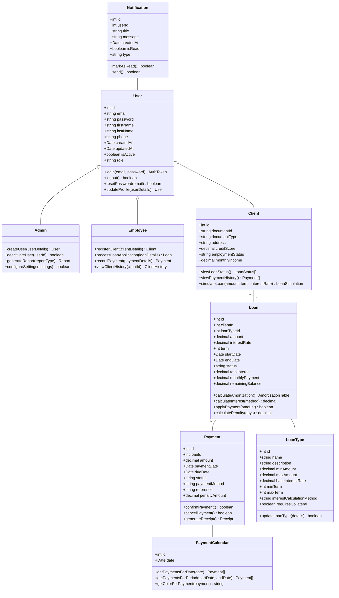
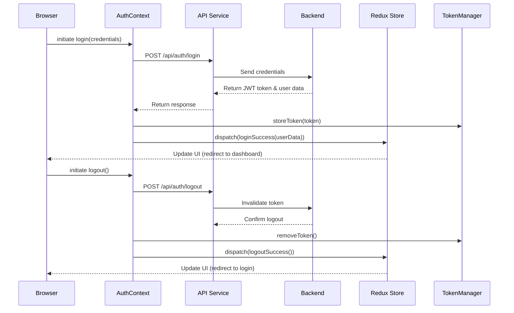
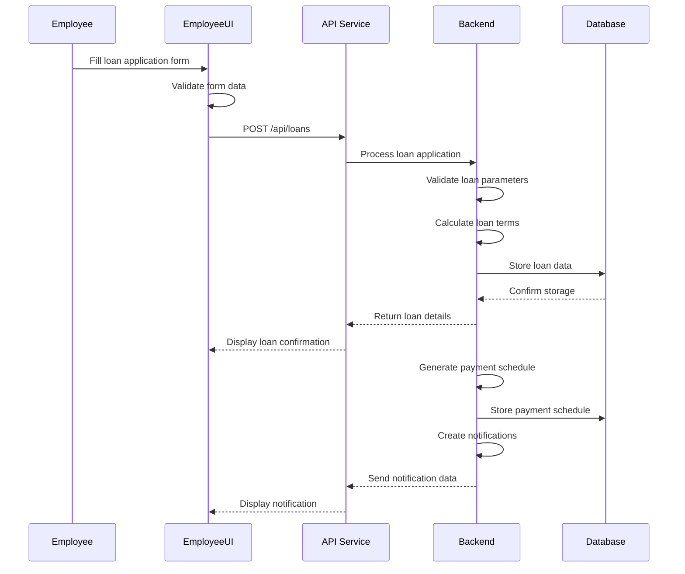
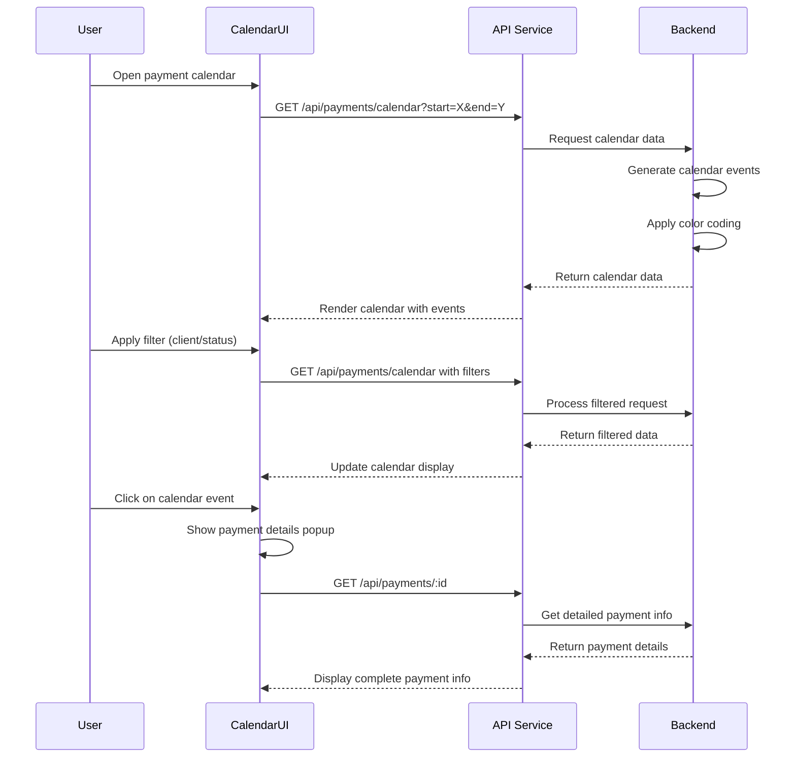
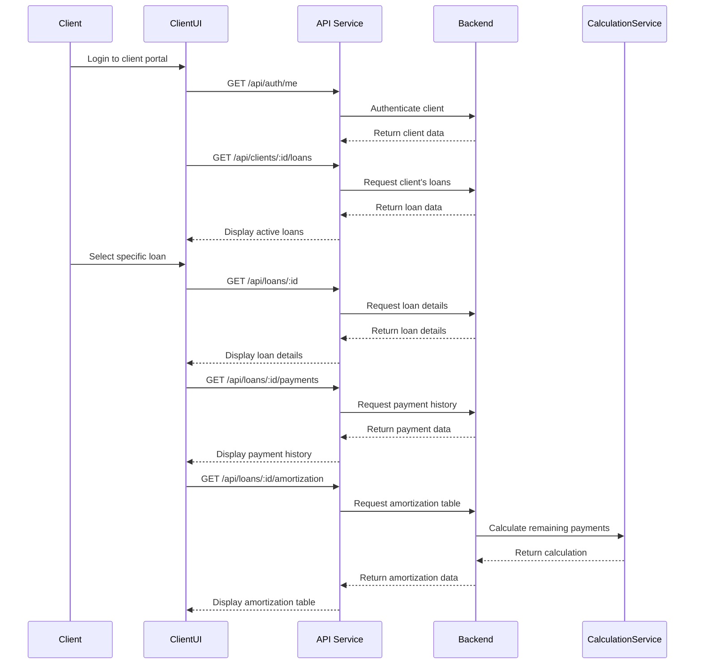
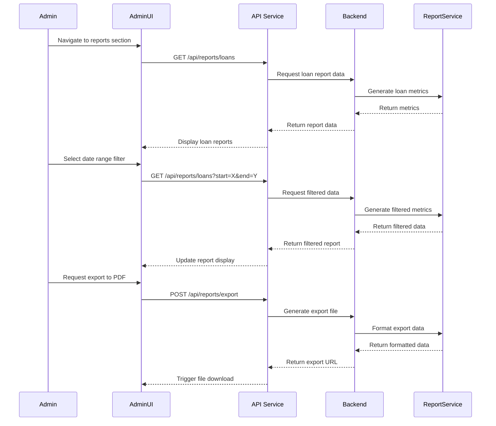

# Sistema de Gestión de Préstamos - System Design Document

## Implementation Approach

Based on the PRD requirements, we will implement a modern web application using React, JavaScript, and Tailwind CSS for the frontend with a focus on creating a responsive, intuitive interface that works across various devices. The application will be structured following best practices for component reusability, state management, and security.

### Key Technologies

#### Frontend
- **React**: For building a component-based UI with efficient rendering
- **React Router**: For client-side routing between different sections of the application
- **Redux Toolkit**: For centralized state management across the application
- **Tailwind CSS**: For utility-first styling that allows rapid UI development
- **React Hook Form**: For efficient form handling with validation
- **Chart.js**: For visualization of financial data and metrics
- **FullCalendar**: For implementing the payment calendar with color coding
- **Axios**: For handling API requests with interceptors for authentication

#### Backend (Assuming a RESTful API service)
- **Node.js/Express**: For a robust API backend
- **JWT**: For secure authentication
- **Sequelize/Mongoose**: For ORM/ODM database interactions

### Difficult Points and Solutions

1. **Complex Financial Calculations**
   - Utilize dedicated libraries like `financial.js` or `dinero.js` for precise money calculations
   - Implement calculation service modules for different interest methods

2. **Calendar Implementation with Color Coding**
   - Leverage FullCalendar with custom event rendering for color-coded payment status
   - Implement efficient filtering and categorization of payment events

3. **Multi-role Access Control**
   - Use a role-based access control (RBAC) system with JWT claims
   - Implement middleware for route protection based on user roles

4. **Responsive Design for Complex Interfaces**
   - Utilize Tailwind CSS breakpoints consistently
   - Design mobile-first components that scale appropriately

5. **Real-time Notifications**
   - Implement WebSocket connection for instant notifications
   - Use service workers for push notifications in browsers

## Data Structures and Interfaces

### Core Entities



### Frontend Component Structure

```mermaid
classDiagram
    App -- AuthContext
    App -- Router
    Router -- PublicRoutes
    Router -- ProtectedRoutes
    ProtectedRoutes -- AdminLayout
    ProtectedRoutes -- ClientLayout
    ProtectedRoutes -- EmployeeLayout
    AdminLayout -- AdminDashboard
    AdminLayout -- LoanManagement
    AdminLayout -- UserManagement
    AdminLayout -- ReportsAnalytics
    AdminLayout -- SystemConfiguration
    ClientLayout -- ClientDashboard
    ClientLayout -- LoanStatus
    ClientLayout -- PaymentHistory
    ClientLayout -- LoanSimulator
    ClientLayout -- ClientProfile
    EmployeeLayout -- EmployeeDashboard
    EmployeeLayout -- ClientRegistration
    EmployeeLayout -- LoanApplication
    EmployeeLayout -- PaymentProcessing
    EmployeeLayout -- ClientManagement
    PaymentCalendar -- CalendarView
    PaymentCalendar -- ColorLegend
    PaymentCalendar -- FilterControls
    Redux -- Actions
    Redux -- Reducers
    Redux -- Store
    Redux -- Middleware
    API -- AuthService
    API -- LoanService
    API -- PaymentService
    API -- UserService
    API -- NotificationService
    API -- ReportService
    AuthContext -- TokenManager
    Utilities -- CalculationService
    Utilities -- ValidationService
    Utilities -- NotificationManager
    Utilities -- FormatService
    
    class App {
        +render()
    }
    
    class AuthContext {
        +user
        +isAuthenticated
        +login(credentials)
        +logout()
        +refreshToken()
    }
    
    class Router {
        +renderRoutes()
    }
    
    class AdminLayout {
        +renderSidebar()
        +renderHeader()
        +renderContent()
    }
    
    class ClientLayout {
        +renderSidebar()
        +renderHeader()
        +renderContent()
    }
    
    class EmployeeLayout {
        +renderSidebar()
        +renderHeader()
        +renderContent()
    }
    
    class AdminDashboard {
        +renderMetrics()
        +renderCharts()
        +renderRecentLoans()
    }
    
    class LoanManagement {
        +renderLoanList()
        +renderLoanDetails()
        +renderLoanForm()
        +handleLoanActions()
    }
    
    class PaymentCalendar {
        +renderCalendarView()
        +handleDateChange()
        +handleEventClick()
    }
    
    class ClientDashboard {
        +renderActiveLoanSummary()
        +renderNextPaymentInfo()
        +renderPaymentHistory()
    }
    
    class Redux {
        +configureStore()
        +dispatch(action)
        +getState()
        +subscribe(listener)
    }
    
    class API {
        +setAuthHeader(token)
        +handleApiError(error)
        +executeRequest(config)
    }
```



## API Endpoints

### Authentication Endpoints

```
POST /api/auth/login                   - Authenticate user and return token
POST /api/auth/logout                  - Invalidate user token
POST /api/auth/refresh-token           - Refresh authentication token
POST /api/auth/forgot-password         - Initiate password reset
POST /api/auth/reset-password          - Complete password reset
GET  /api/auth/me                       - Get current user info
```

### User Management Endpoints

```
GET    /api/users                       - Get all users (admin)
GET    /api/users/:id                   - Get specific user details
POST   /api/users                       - Create new user
PUT    /api/users/:id                   - Update user details
DELETE /api/users/:id                   - Deactivate user
PUT    /api/users/:id/activate          - Activate user
GET    /api/users/:id/notifications     - Get user notifications
```

### Client Endpoints

```
GET    /api/clients                     - Get all clients (admin/employee)
GET    /api/clients/:id                 - Get specific client details
POST   /api/clients                     - Register new client
PUT    /api/clients/:id                 - Update client details
GET    /api/clients/:id/loans           - Get client loans
GET    /api/clients/:id/payments        - Get client payments
```

### Loan Endpoints

```
GET    /api/loans                       - Get all loans (filtered by role)
GET    /api/loans/:id                   - Get specific loan details
POST   /api/loans                       - Create new loan
PUT    /api/loans/:id                   - Update loan details
PUT    /api/loans/:id/status            - Update loan status
GET    /api/loans/:id/payments          - Get loan payments
GET    /api/loans/:id/amortization      - Get loan amortization table
POST   /api/loans/simulate              - Simulate loan calculation
```

### Payment Endpoints

```
GET    /api/payments                    - Get all payments (filtered by role)
GET    /api/payments/:id                - Get specific payment details
POST   /api/payments                    - Record new payment
PUT    /api/payments/:id                - Update payment details
PUT    /api/payments/:id/status         - Update payment status
GET    /api/payments/calendar           - Get payments for calendar view
GET    /api/payments/upcoming           - Get upcoming payments
GET    /api/payments/overdue            - Get overdue payments
```

### Report Endpoints

```
GET    /api/reports/loans               - Get loan reports
GET    /api/reports/payments            - Get payment reports
GET    /api/reports/clients             - Get client reports
GET    /api/reports/performance         - Get performance metrics
POST   /api/reports/export              - Export report data
```

### Configuration Endpoints

```
GET    /api/config/loan-types           - Get loan types
POST   /api/config/loan-types           - Create loan type
PUT    /api/config/loan-types/:id       - Update loan type
GET    /api/config/system               - Get system configuration
PUT    /api/config/system               - Update system configuration
```

## Program Call Flow

### Authentication Flow



### Loan Application Process



### Payment Calendar Visualization



### Client Loan Status View



### Admin Reporting Flow



## State Management Strategy

### Redux Store Structure

```typescript
interface RootState {
  auth: AuthState;
  users: UsersState;
  clients: ClientsState;
  loans: LoansState;
  payments: PaymentsState;
  notifications: NotificationsState;
  calendar: CalendarState;
  reports: ReportsState;
  config: ConfigState;
  ui: UIState;
}

interface AuthState {
  user: User | null;
  isAuthenticated: boolean;
  token: string | null;
  loading: boolean;
  error: string | null;
}

interface LoansState {
  loans: Loan[];
  currentLoan: Loan | null;
  loading: boolean;
  error: string | null;
  amortization: AmortizationEntry[] | null;
  simulation: LoanSimulation | null;
}

interface PaymentsState {
  payments: Payment[];
  currentPayment: Payment | null;
  calendarEvents: CalendarEvent[];
  loading: boolean;
  error: string | null;
  upcoming: Payment[];
  overdue: Payment[];
}

interface CalendarState {
  events: CalendarEvent[];
  viewDate: Date;
  filters: {
    client: number | null;
    status: string | null;
    startDate: Date;
    endDate: Date;
  };
  loading: boolean;
  error: string | null;
}
```

### Redux Action Types

```typescript
// Auth Actions
const AUTH_LOGIN_REQUEST = 'auth/loginRequest';
const AUTH_LOGIN_SUCCESS = 'auth/loginSuccess';
const AUTH_LOGIN_FAILURE = 'auth/loginFailure';
const AUTH_LOGOUT = 'auth/logout';
const AUTH_REFRESH_TOKEN = 'auth/refreshToken';

// Loan Actions
const LOANS_FETCH_ALL = 'loans/fetchAll';
const LOANS_FETCH_ONE = 'loans/fetchOne';
const LOANS_CREATE = 'loans/create';
const LOANS_UPDATE = 'loans/update';
const LOANS_UPDATE_STATUS = 'loans/updateStatus';
const LOANS_FETCH_AMORTIZATION = 'loans/fetchAmortization';
const LOANS_SIMULATE = 'loans/simulate';

// Payment Actions
const PAYMENTS_FETCH_ALL = 'payments/fetchAll';
const PAYMENTS_FETCH_ONE = 'payments/fetchOne';
const PAYMENTS_CREATE = 'payments/create';
const PAYMENTS_UPDATE = 'payments/update';
const PAYMENTS_FETCH_CALENDAR = 'payments/fetchCalendar';
const PAYMENTS_FETCH_UPCOMING = 'payments/fetchUpcoming';
const PAYMENTS_FETCH_OVERDUE = 'payments/fetchOverdue';
```

### Context for Global State

While Redux is used for most app state, some concerns like authentication are better managed with React Context:

```jsx
// AuthContext.jsx
export const AuthContext = createContext();

export function AuthProvider({ children }) {
  const [user, setUser] = useState(null);
  const [isAuthenticated, setIsAuthenticated] = useState(false);
  const [loading, setLoading] = useState(true);
  const [error, setError] = useState(null);
  
  // Initialize authentication state on app load
  useEffect(() => {
    const initAuth = async () => {
      try {
        const token = TokenManager.getToken();
        if (token) {
          API.setAuthHeader(token);
          const userData = await AuthService.getCurrentUser();
          setUser(userData);
          setIsAuthenticated(true);
        }
      } catch (error) {
        console.error('Auth initialization failed:', error);
        TokenManager.removeToken();
      } finally {
        setLoading(false);
      }
    };
    
    initAuth();
  }, []);
  
  const login = async (credentials) => {
    try {
      setLoading(true);
      const { token, user } = await AuthService.login(credentials);
      TokenManager.storeToken(token);
      API.setAuthHeader(token);
      setUser(user);
      setIsAuthenticated(true);
      return user;
    } catch (error) {
      setError(error.message);
      throw error;
    } finally {
      setLoading(false);
    }
  };
  
  const logout = async () => {
    try {
      setLoading(true);
      await AuthService.logout();
      TokenManager.removeToken();
      API.removeAuthHeader();
      setUser(null);
      setIsAuthenticated(false);
    } catch (error) {
      console.error('Logout error:', error);
    } finally {
      setLoading(false);
    }
  };
  
  const refreshToken = async () => {
    try {
      const newToken = await AuthService.refreshToken();
      TokenManager.storeToken(newToken);
      API.setAuthHeader(newToken);
      return true;
    } catch (error) {
      logout();
      return false;
    }
  };
  
  const contextValue = {
    user,
    isAuthenticated,
    loading,
    error,
    login,
    logout,
    refreshToken
  };
  
  return (
    <AuthContext.Provider value={contextValue}>
      {children}
    </AuthContext.Provider>
  );
}
```

## UI/UX Considerations

### Role-Based Interface Strategy

The application will have three distinct layout experiences tailored for each user role:

1. **Admin Layout**: Focuses on global system management with prominent analytics and reporting
2. **Employee Layout**: Optimizes client management and loan processing workflows
3. **Client Layout**: Simplifies loan status viewing and payment history with minimal complexity

### Responsive Design Approach

- Use Tailwind CSS breakpoints consistently across all components
- Design with mobile-first approach, then enhance for larger screens
- Implement collapsible navigation for mobile views
- Use responsive data tables that transform to cards on small screens

### Accessibility Features

- Implement ARIA attributes throughout the application
- Ensure keyboard navigability for all interactive elements
- Maintain sufficient color contrast ratios (WCAG AA compliance)
- Provide text alternatives for all non-text content

### Color Coding System

The payment calendar will use a consistent color system:

- **Green**: Completed payments
- **Yellow**: Upcoming payments (due within 7 days)
- **Red**: Overdue payments
- **Gray**: Scheduled future payments

## Security Considerations

1. **Authentication**:
   - JWT authentication with refresh tokens
   - Password storage with bcrypt hashing
   - Multi-factor authentication for administrative users

2. **Authorization**:
   - Role-based access control (RBAC)
   - Route protection middleware
   - Component-level permission checks

3. **Data Protection**:
   - HTTPS for all communications
   - Form data validation and sanitization
   - Protection against common web vulnerabilities (XSS, CSRF)

4. **Auditing**:
   - Comprehensive audit logs for all financial transactions
   - Activity tracking for sensitive operations

## Testing Strategy

1. **Unit Tests**:
   - Test individual components and services
   - Focus on calculation functions and form validation

2. **Integration Tests**:
   - Test interaction between components
   - API service integration tests

3. **E2E Tests**:
   - Complete user workflows (loan application, payment processing)
   - Role-based access testing

## Anything UNCLEAR

1. **Payment Processing Integration**: The PRD doesn't specify if the system should integrate with third-party payment processors or merely record payments made through other channels. Clarification would help refine the payment processing components.

2. **Data Import/Export Requirements**: There's no mention of requirements for importing existing loan data or exporting data from the system. This capability might be needed for migration or reporting purposes.

3. **Internationalization Requirements**: The current design assumes a single language (Spanish based on the system name), but if multiple languages are required, additional UI considerations would be needed.

4. **Mobile App Requirements**: The PRD mentions a mobile app as a P2 requirement. Clarification on whether this should be native or a progressive web app would impact the technology choices.

5. **Data Retention Policies**: The system will handle sensitive financial data. Clarification on data retention requirements would be helpful for designing the database architecture.

## Implementation Phases

### Phase 1: Foundation (4 weeks)
- Project setup and configuration
- Authentication system implementation
- Basic user management
- Core UI components and layouts

### Phase 2: Core Functionality (6 weeks)
- Loan management functionality
- Client registration and management
- Basic payment recording
- Initial dashboard implementations

### Phase 3: Advanced Features (4 weeks)
- Payment calendar with color coding
- Automated calculations and amortization tables
- Notification system
- Reporting functionality

### Phase 4: Refinement (2 weeks)
- Performance optimization
- User experience improvements
- Testing and bug fixing
- Documentation