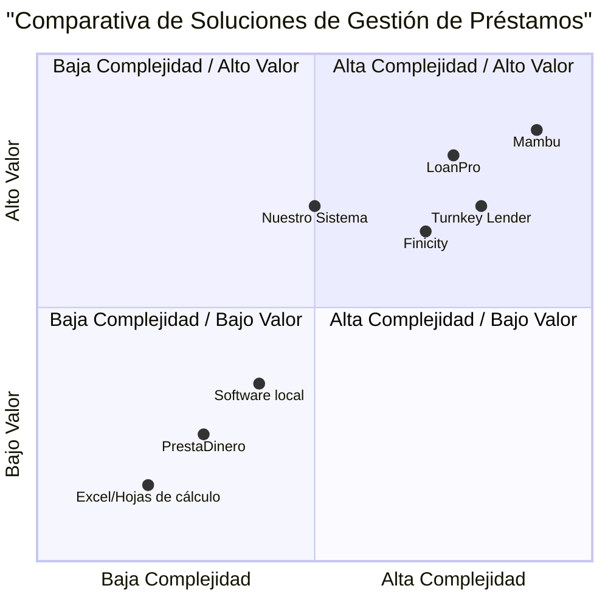

# Documento de Requisitos del Producto (PRD)

## Sistema de Gestión de Préstamos

*Fecha: 15 de Mayo de 2025*

## Tabla de Contenidos

1. [Información del Proyecto](#1-información-del-proyecto)
2. [Definición del Producto](#2-definición-del-producto)
   - [Objetivos del Producto](#21-objetivos-del-producto)
   - [Historias de Usuario](#22-historias-de-usuario)
   - [Análisis Competitivo](#23-análisis-competitivo)
   - [Cuadrante Competitivo](#24-cuadrante-competitivo)
3. [Especificaciones Técnicas](#3-especificaciones-técnicas)
   - [Análisis de Requisitos](#31-análisis-de-requisitos)
   - [Pool de Requisitos](#32-pool-de-requisitos)
   - [Bosquejo de Diseño UI](#33-bosquejo-de-diseño-ui)
   - [Preguntas Abiertas](#34-preguntas-abiertas)

## 1. Información del Proyecto

- **Lenguaje de Programación**: JavaScript, React, Tailwind CSS
- **Nombre del Proyecto**: sistema_gestion_prestamos
- **Requisitos Originales**: Desarrollo de una aplicación web para gestión de préstamos con múltiples perfiles de usuario (administrador, empleados, clientes). El sistema debe permitir el registro de clientes, gestión de préstamos, seguimiento de pagos y cálculos automáticos de intereses y deudas pendientes.

## 2. Definición del Producto

### 2.1 Objetivos del Producto

1. **Centralizar la gestión de préstamos**: Crear una plataforma única que permita administrar todo el ciclo de vida de los préstamos, desde la originación hasta el pago completo, mejorando la eficiencia operativa y reduciendo errores manuales.

2. **Mejorar la transparencia para los clientes**: Proporcionar a los clientes acceso claro y en tiempo real a la información de sus préstamos, calendarios de pago y estado de cuenta, fortaleciendo la confianza y reduciendo consultas.

3. **Optimizar los procesos operativos**: Automatizar cálculos, recordatorios y seguimiento de pagos para reducir la carga administrativa del personal y permitirles enfocarse en actividades de mayor valor.

### 2.2 Historias de Usuario

1. **Como administrador**, quiero tener acceso completo al sistema para poder gestionar usuarios, configurar parámetros globales y supervisar todas las operaciones de préstamos, de modo que pueda mantener el control total sobre el negocio.

2. **Como empleado**, quiero poder registrar nuevos clientes y configurar sus préstamos para poder atender rápidamente sus necesidades sin depender del administrador, facilitando así la escalabilidad del negocio.

3. **Como cliente**, quiero ver el estado actualizado de mis préstamos para poder planificar mis pagos y entender claramente mi situación financiera actual sin necesidad de contactar directamente al prestamista.

4. **Como empleado**, quiero un sistema automatizado de cálculo de intereses y calendarios de pago para poder ofrecer información precisa a los clientes sin realizar cálculos manuales propensos a errores.

5. **Como cliente**, quiero recibir notificaciones sobre próximos pagos para poder cumplir con mis obligaciones a tiempo y evitar cargos por mora o penalizaciones.

### 2.3 Análisis Competitivo

#### 1. **Soluciones tradicionales (Excel/Hojas de cálculo)**
**Pros:**
- Flexibilidad y personalización
- Bajo costo inicial
- Familiaridad para muchos usuarios

**Contras:**
- Propenso a errores humanos
- Limitaciones para múltiples usuarios
- Sin acceso para clientes
- Difícil mantenimiento y escalabilidad
- Sin automatizaciones avanzadas

#### 2. **Mambu**
**Pros:**
- Plataforma robusta para instituciones financieras
- Altamente configurable
- API extensiva
- Cumplimiento normativo integrado

**Contras:**
- Precio elevado
- Complejidad de implementación
- Curva de aprendizaje pronunciada
- Excesivo para pequeñas operaciones

#### 3. **LoanPro**
**Pros:**
- Especializado en préstamos
- Buena interfaz de usuario
- Reportes detallados
- Automatización de procesos

**Contras:**
- Costos recurrentes significativos
- Algunas funciones avanzadas requieren módulos adicionales
- Menos adaptado para mercados latinoamericanos

#### 4. **Lending Software by Turnkey Lender**
**Pros:**
- Suite completa de préstamos
- Buenas capacidades de automatización
- Opciones de implementación en nube o local

**Contras:**
- Alto costo de implementación
- Personalización limitada
- Soporte técnico variable

#### 5. **Finicity Loan**
**Pros:**
- Verificación de ingresos integrada
- Buenos controles de riesgo
- Experiencia de usuario moderna

**Contras:**
- Enfocado principalmente en el mercado estadounidense
- Menor flexibilidad para modelos de negocio alternativos
- Integración compleja con sistemas locales

#### 6. **Software personalizado local**
**Pros:**
- Adaptado a necesidades específicas locales
- Opciones de pago únicamente iniciales
- Soporte en idioma local

**Contras:**
- Funcionalidades limitadas
- Actualizaciones poco frecuentes
- Interfaz de usuario menos sofisticada
- Seguridad variable

#### 7. **PrestaDinero (ficticio - solución local)**
**Pros:**
- Enfoque en préstamos personales informales
- Interfaz simplificada
- Costos accesibles

**Contras:**
- Funcionalidades básicas
- Sin portal para clientes
- Limitadas opciones de reportería
- Sin cálculo avanzado de intereses

### 2.4 Cuadrante Competitivo

## 3. Especificaciones Técnicas

### 3.1 Análisis de Requisitos

El sistema de gestión de préstamos debe cumplir con diversas necesidades funcionales y técnicas para satisfacer los requerimientos del negocio y proporcionar una experiencia óptima tanto para administradores, empleados como para clientes. A continuación se presenta un análisis detallado de los requisitos:

#### Arquitectura del Sistema

El sistema debe implementarse como una aplicación web moderna con arquitectura cliente-servidor. La aplicación debe ser responsive para funcionar correctamente en dispositivos móviles y de escritorio. Se utilizará React para el frontend, con un diseño basado en componentes utilizando Tailwind CSS para la interfaz visual. El backend deberá gestionar la lógica de negocio, cálculos financieros, y la persistencia de datos en una base de datos relacional.

#### Perfiles de Usuario

El sistema debe soportar tres tipos distintos de perfiles de usuario con diferentes niveles de acceso y funcionalidades:

1. **Administrador**: Acceso completo a todas las funcionalidades del sistema, incluyendo configuración global, gestión de usuarios y reportes avanzados.

2. **Empleado**: Acceso a registro de clientes, creación y gestión de préstamos, y seguimiento de pagos.

3. **Cliente**: Acceso limitado a la información de sus propios préstamos, calendario de pagos y estado de cuenta.

#### Gestión de Clientes

Los empleados deben poder registrar nuevos clientes en el sistema, capturando información personal esencial:

- Nombre completo
- Número de cédula/identificación
- Dirección completa
- Fotografía del cliente
- Información de contacto (teléfono, correo electrónico)
- Datos adicionales relevantes para la evaluación crediticia

#### Gestión de Préstamos

El sistema debe permitir la creación y configuración completa de préstamos:

- Registro de monto del préstamo
- Configuración de tasa de interés
- Definición de plazo (días o meses)
- Establecimiento de plan de pagos (fechas específicas o periodicidad)
- Cálculo automático de cuotas, desglosando capital e intereses
- Registro de garantías o colaterales (si aplica)

#### Calendario y Seguimiento de Pagos

Un componente crítico es el calendario de pagos que debe:

- Visualizar claramente las fechas de pago programadas
- Mostrar con código de colores el estado de los pagos (verde para pagados, rojo para no pagados)
- Permitir el registro de pagos realizados
- Calcular automáticamente saldos pendientes tras cada pago
- Generar alertas por pagos vencidos

#### Cálculos Financieros

El sistema debe realizar automáticamente diversos cálculos financieros:

- Cálculo de intereses según diferentes modalidades (simple, compuesto, etc.)
- Amortización de préstamos
- Proyección de pagos futuros
- Cálculo de moras o recargos por pagos tardíos
- Actualización en tiempo real del saldo pendiente

#### Reportes y Análisis

El sistema debe proporcionar capacidades de reportería para la toma de decisiones:

- Estado general de la cartera de préstamos
- Análisis de morosidad
- Proyecciones de flujo de caja
- Rendimiento por cliente o tipo de préstamo
- Reportes personalizados según necesidades específicas

#### Seguridad

La seguridad es fundamental en un sistema que maneja información financiera sensible:

- Autenticación segura para todos los usuarios
- Autorización basada en roles para controlar accesos
- Encriptación de datos sensibles
- Registro de auditoría para actividades críticas
- Protección contra vulnerabilidades web comunes

### 3.2 Pool de Requisitos

#### P0 (Must Have) - Críticos para el lanzamiento

1. **Gestión de usuarios y perfiles**
   - Creación y gestión de cuentas de administrador, empleados y clientes
   - Control de acceso basado en roles
   - El administrador debe poder crear cuentas para empleados

2. **Registro de clientes**
   - Formulario completo para captura de datos personales (nombre, cédula, dirección)
   - Carga y almacenamiento de fotografía del cliente
   - Búsqueda y filtrado de clientes registrados

3. **Gestión de préstamos**
   - Creación de préstamos con montos, tasas de interés y plazos
   - Configuración de calendario de pagos
   - Cálculo automático de cuotas y distribución entre capital e intereses

4. **Portal del cliente**
   - Vista de resumen de préstamos activos
   - Visualización de calendario de pagos
   - Consulta de saldo pendiente actualizado

5. **Calendario de pagos**
   - Visualización clara de fechas de pago
   - Diferenciación visual entre pagos realizados y pendientes (verde/rojo)
   - Registro de pagos realizados

6. **Cálculos financieros básicos**
   - Cálculo automático de intereses
   - Actualización de saldo deudor tras pagos
   - Cálculo de estado actual del préstamo

#### P1 (Should Have) - Importantes pero no críticos inicialmente

1. **Notificaciones y recordatorios**
   - Alertas de préstamos próximos a vencer
   - Recordatorios de pagos próximos
   - Notificaciones de pagos vencidos

2. **Dashboard para administrador**
   - Vista consolidada de cartera de préstamos
   - Indicadores clave de rendimiento
   - Alertas de morosidad

3. **Reportes básicos**
   - Reporte de préstamos activos
   - Reporte de pagos recibidos
   - Análisis básico de morosidad

4. **Historial de transacciones**
   - Registro detallado de todas las operaciones
   - Trazabilidad de modificaciones a préstamos
   - Registro de auditoría básico

5. **Exportación de datos**
   - Exportación de reportes a Excel/CSV
   - Generación de estados de cuenta en PDF
   - Impresión de calendarios de pago

#### P2 (Nice to Have) - Deseables para futuras versiones

1. **Aplicación móvil complementaria**
   - Versión simplificada para acceso desde smartphones
   - Notificaciones push
   - Registro de pagos mediante aplicación

2. **Integración con pasarelas de pago**
   - Opción para realizar pagos en línea
   - Registro automático de pagos recibidos
   - Conciliación bancaria

3. **Análisis avanzado y Business Intelligence**
   - Modelos predictivos de comportamiento de pago
   - Segmentación de clientes
   - Análisis de rentabilidad por segmento

4. **Gestión de documentos**
   - Almacenamiento digital de contratos
   - Firma electrónica
   - Repositorio de documentos por cliente

5. **Configuración avanzada de productos**
   - Creación de múltiples tipos de productos de préstamo
   - Personalización de reglas de negocio por producto
   - Periodos de gracia y opciones de refinanciación

### 3.3 Bosquejo de Diseño UI

#### Diseño General

El sistema seguirá un diseño moderno, limpio y responsive, optimizado tanto para dispositivos móviles como de escritorio. La interfaz utilizará un esquema de navegación intuitivo con las siguientes características:

- Menú lateral para navegación principal (colapsable en móviles)
- Encabezado con información del usuario y accesos rápidos
- Área de contenido principal adaptable
- Sistema de notificaciones integrado
- Esquema de colores consistente, profesional y accesible

#### Panel de Administrador

**Dashboard Principal**
- KPIs principales: total préstamos activos, monto total prestado, tasa promedio de interés
- Gráficos de estado de la cartera (distribución por estado, morosidad)
- Alertas importantes y notificaciones del sistema
- Accesos directos a funciones principales

**Gestión de Usuarios**
- Lista de usuarios con filtros y búsqueda
- Formulario de creación/edición de usuarios
- Asignación de roles y permisos
- Registro de actividad de usuarios

**Configuración del Sistema**
- Parámetros generales
- Configuración de tasas predeterminadas
- Personalización de notificaciones
- Opciones de seguridad

#### Portal de Empleados

**Registro de Clientes**
- Formulario estructurado para datos personales
- Componente para carga de fotografía con vista previa
- Validación en tiempo real de campos clave (cédula)
- Búsqueda y filtrado de clientes existentes

**Gestión de Préstamos**
- Asistente paso a paso para creación de préstamos
- Calculadora interactiva para simulación de escenarios
- Calendario visual para selección de fechas de pago
- Vista de detalle de préstamos activos

**Registro de Pagos**
- Interfaz para búsqueda rápida de préstamos pendientes
- Formulario simplificado para registro de pagos
- Confirmación visual de pagos registrados
- Historial de pagos por préstamo

#### Portal de Clientes

**Resumen de Cuenta**
- Vista general de préstamos activos
- Monto total pendiente de pago
- Próximo pago (fecha y monto)
- Historial reciente de transacciones

**Detalle de Préstamos**
- Información completa del préstamo
- Desglose de capital e intereses
- Estado actual y progreso del préstamo
- Descarga de estado de cuenta

**Calendario de Pagos**
- Visualización mensual/semanal de calendario
- Codificación por colores: verde (pagado), rojo (no pagado)
- Detalle de pagos al hacer clic en fechas específicas
- Recordatorios visuales de próximos vencimientos

### 3.4 Preguntas Abiertas

1. **Definición de esquema de intereses:** ¿Se manejarán tasas de interés fijas, variables o ambas? ¿Cómo se calculará el interés (diario, mensual, anual)? ¿Se contempla interés moratorio adicional?

2. **Políticas de seguridad:** ¿Qué nivel de seguridad se requiere para la información sensible? ¿Se necesitan requisitos específicos de cumplimiento normativo para el manejo de datos personales?

3. **Implementación de notificaciones:** ¿Se enviarán notificaciones por correo electrónico, SMS, o solo dentro de la aplicación? ¿Con qué frecuencia se deberían enviar los recordatorios?

4. **Estrategia de respaldo:** ¿Cuál será la política de respaldo de datos? ¿Se requiere un plan de recuperación ante desastres específico?

5. **Escalabilidad del sistema:** ¿Cuál es el volumen esperado de clientes y préstamos a corto y mediano plazo? ¿Hay planes de expansión que deban considerarse en la arquitectura inicial?

6. **Integración con otros sistemas:** ¿Se requiere integración con sistemas contables, bancarios o de verificación de identidad? ¿Existen APIs específicas que deban ser contempladas?

7. **Opciones de personalización:** ¿Qué nivel de personalización se requerirá para diferentes tipos de préstamos o condiciones especiales?