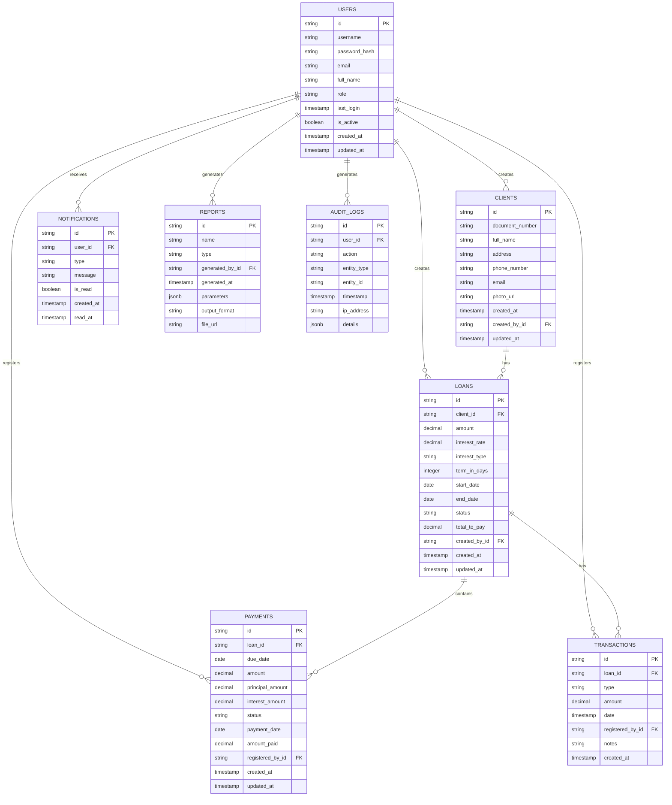

# Sistema de Gestión de Préstamos - Diseño del Sistema

## Implementación approach

Para implementar el Sistema de Gestión de Préstamos, utilizaremos una arquitectura moderna de aplicación web con separación clara entre frontend y backend. Este enfoque nos permitirá construir una plataforma escalable, segura y con una experiencia de usuario óptima.

### Stack Tecnológico

**Frontend:**
- React como framework principal para la interfaz de usuario
- Tailwind CSS para el diseño responsive y consistente
- Redux para gestión del estado de la aplicación
- React Router para la navegación entre componentes
- Formik y Yup para validación de formularios
- React-Calendar para implementación del calendario de pagos
- Chart.js para visualización de datos y reportes

**Backend:**
- Node.js con Express.js como framework del servidor
- Prisma como ORM para comunicación con la base de datos
- JWT para autenticación y autorización basada en tokens
- Bcrypt para encriptación de contraseñas
- Multer para manejo de subida de archivos (fotografías de clientes)

**Base de Datos:**
- PostgreSQL como base de datos relacional principal
- Redis para caché y manejo de sesiones

**Infraestructura:**
- Docker para contenedorización
- NGINX como servidor web y proxy inverso
- AWS/Azure/GCP para hosting (según preferencias del cliente)

**Testing y QA:**
- Jest para pruebas unitarias e integración
- Cypress para pruebas end-to-end

### Puntos Críticos de Implementación

1. **Seguridad**: Implementación de autenticación JWT, control de acceso basado en roles, y protección de datos sensibles mediante encriptación.

2. **Cálculos Financieros**: Desarrollo de módulos robustos para cálculo de intereses, amortización y proyección de pagos que sean precisos y configurable según diferentes modalidades.

3. **Sistema de Roles**: Desarrollo de un sistema flexible de roles y permisos que permita segregar claramente las funcionalidades para administradores, empleados y clientes.

4. **Visualización del Calendario**: Implementación de un componente de calendario interactivo con codificación por colores para seguimiento eficiente de los pagos.

5. **Escalabilidad**: Diseño pensado para soportar crecimiento en volumen de datos y usuarios sin comprometer el rendimiento.

### Enfoque de Desarrollo

Se recomienda un enfoque de desarrollo iterativo con las siguientes fases:

1. **Fase 1**: Implementación de funcionalidades P0 (Must Have) - Gestión de usuarios, registro de clientes, gestión básica de préstamos, cálculos financieros fundamentales y portal de clientes con calendario de pagos.

2. **Fase 2**: Implementación de funcionalidades P1 (Should Have) - Notificaciones, dashboard para administrador, reportes básicos, historial de transacciones y exportación de datos.

3. **Fase 3**: Implementación de funcionalidades P2 (Nice to Have) - Integraciones con sistemas externos, análisis avanzado y business intelligence, gestión de documentos y configuración avanzada de productos.

## Arquitectura del Sistema

### Arquitectura General

El sistema seguirá una arquitectura de aplicación web moderna de tipo cliente-servidor, con clara separación de responsabilidades:

1. **Capa de Presentación (Frontend)**: Interfaz de usuario desarrollada en React, responsive y optimizada tanto para dispositivos móviles como de escritorio.

2. **Capa de Aplicación (Backend)**: API RESTful desarrollada en Node.js/Express que implementa la lógica de negocio, validaciones, cálculos financieros y gestión de datos.

3. **Capa de Datos**: Persistencia en base de datos PostgreSQL con esquemas optimizados para las entidades principales del sistema.

4. **Capa de Seguridad**: Implementación transversal que abarca autenticación, autorización, encriptación y auditoría.

5. **Servicios Auxiliares**: Componentes para envío de notificaciones, generación de reportes y procesamiento asíncrono.


## Data structures and interfaces

A continuación se presentan las principales estructuras de datos e interfaces del sistema. Este diseño se ha realizado considerando las entidades principales del negocio y las relaciones entre ellas.

### Diagrama de Clases

A continuación se muestra el diagrama de clases que representa las estructuras de datos principales del sistema:


## Program call flow

A continuación se presenta el diagrama de secuencia que ilustra los flujos principales del sistema, incluyendo la autenticación, registro de clientes, creación de préstamos y gestión de pagos:


## API Endpoints

A continuación se detallan los principales endpoints de la API que soportarán las funcionalidades del sistema:

### Autenticación y Usuarios

```
POST /api/auth/login              - Iniciar sesión
POST /api/auth/logout             - Cerrar sesión
GET  /api/auth/me                 - Obtener información del usuario actual
PUT  /api/auth/change-password    - Cambiar contraseña

GET  /api/users                   - Listar usuarios (admin)
POST /api/users                   - Crear usuario (admin)
GET  /api/users/:id               - Obtener detalle de usuario
PUT  /api/users/:id               - Actualizar usuario
DELETE /api/users/:id             - Desactivar usuario
```

### Clientes

```
GET  /api/clients                 - Listar clientes
POST /api/clients                 - Registrar nuevo cliente
GET  /api/clients/:id             - Obtener detalle de cliente
PUT  /api/clients/:id             - Actualizar información de cliente
DELETE /api/clients/:id           - Eliminar cliente
POST /api/clients/:id/photo       - Subir foto de cliente
GET  /api/clients/:id/loans       - Obtener préstamos de un cliente
```

### Préstamos

```
GET  /api/loans                   - Listar préstamos
POST /api/loans                   - Crear nuevo préstamo
GET  /api/loans/:id               - Obtener detalle de préstamo
PUT  /api/loans/:id               - Actualizar préstamo
POST /api/loans/simulate          - Simular préstamo (cálculo sin guardar)
GET  /api/loans/:id/payments      - Obtener calendario de pagos
GET  /api/loans/:id/transactions  - Obtener transacciones de un préstamo
```

### Pagos

```
GET  /api/payments                - Listar pagos
POST /api/payments                - Registrar nuevo pago
GET  /api/payments/:id            - Obtener detalle de pago
PUT  /api/payments/:id            - Actualizar pago
GET  /api/payments/calendar       - Obtener calendario de pagos (todos)
GET  /api/payments/calendar/:date - Obtener pagos por fecha
GET  /api/payments/late           - Obtener pagos atrasados
```

### Notificaciones

```
GET  /api/notifications           - Obtener notificaciones del usuario
PUT  /api/notifications/:id/read  - Marcar notificación como leída
POST /api/notifications/read-all  - Marcar todas como leídas
```

### Reportes

```
GET  /api/reports                 - Listar reportes disponibles
POST /api/reports/generate        - Generar reporte personalizado
GET  /api/reports/loan-status     - Reporte de estado de préstamos
GET  /api/reports/payments/:period - Reporte de pagos por período
GET  /api/reports/download/:id    - Descargar reporte generado
```

## Estructura de la Base de Datos

### Diagrama Entidad-Relación

A continuación se muestra el esquema principal de base de datos que soportará el sistema, con las tablas principales y sus relaciones:



## Componentes Frontend

### Estructura de Componentes

La aplicación frontend se estructurará siguiendo un enfoque modular y basado en componentes, con la siguiente organización:

1. **Componentes Comunes**
   - Header/Navbar
   - Sidebar/Menu
   - Footer
   - NotificationBadge
   - Modal
   - Form Elements (Input, Select, DatePicker, etc.)
   - Button
   - Card
   - Table
   - Pagination
   - AlertMessage
   - LoadingSpinner

2. **Páginas por Rol**

   **Admin**
   - Dashboard
   - UserManagement
   - SystemSettings
   - Reports
   - AuditLogs

   **Empleado**
   - ClientList
   - ClientRegistration
   - ClientDetail
   - LoanCreation
   - LoanList
   - LoanDetail
   - PaymentRegistration
   - PaymentCalendar

   **Cliente**
   - MyLoans
   - LoanDetail
   - PaymentSchedule
   - PaymentHistory
   - Profile

3. **Servicios Frontend**
   - AuthService
   - UserService
   - ClientService
   - LoanService
   - PaymentService
   - NotificationService
   - ReportService
   - FileUploadService

### Mockups de Pantallas Principales

**Login**


**Dashboard Administrador**


**Registro de Cliente**


**Creación de Préstamo**


**Calendario de Pagos**


**Portal del Cliente**


## Plan de Seguridad

### Autenticación y Autorización

1. **Sistema de Autenticación**
   - Implementación de JWT (JSON Web Tokens) para autenticación sin estado
   - Tokens con tiempo de expiración limitado
   - Refresh tokens para mantener sesiones activas de forma segura
   - Bloqueo de cuenta después de múltiples intentos fallidos

2. **Control de Acceso Basado en Roles (RBAC)**
   - Implementación de tres roles principales: Admin, Empleado y Cliente
   - Permisos granulares por endpoint y recurso
   - Middleware de autorización en el backend para validación de permisos

3. **Seguridad de Datos**
   - Encriptación de datos sensibles en la base de datos (contraseñas con bcrypt)
   - Encriptación de comunicaciones mediante HTTPS
   - Implementación de políticas de datos sensibles para información personal y financiera

4. **Auditoría y Trazabilidad**
   - Registro detallado de todas las operaciones críticas
   - Almacenamiento de información de auditoría (quién, qué, cuándo, desde dónde)
   - Monitoreo de actividades sospechosas

## Escalabilidad y Desempeño

### Estrategia de Escalabilidad

1. **Escalabilidad Horizontal**
   - Arquitectura stateless para permitir múltiples instancias del backend
   - Uso de balanceadores de carga para distribuir el tráfico
   - Implementación de caché distribuida con Redis para datos de alta demanda

2. **Optimización de Base de Datos**
   - Índices adecuados para consultas frecuentes
   - Particionamiento de tablas para datos históricos
   - Consultas optimizadas y uso de vistas materializadas para reportes complejos

3. **Estrategia de Caché**
   - Implementación de caché para datos de referencia y configuración
   - Caché de sesión para mejorar rendimiento de autenticación
   - Caché de consultas frecuentes (calendarios, resúmenes de préstamos)

## Anything UNCLEAR

Durante el diseño del sistema, han surgido algunos aspectos que requieren aclaración:

1. **Modelo exacto de cálculo de intereses**: Es necesario determinar las fórmulas específicas para el cálculo de intereses (simple, compuesto, etc.) y si se aplicarán diferentes métodos según el tipo de préstamo.

2. **Políticas de mora**: Falta definir cómo se calculará el interés moratorio, si existirá un periodo de gracia y cómo se aplicarán los recargos por pagos tardíos.

3. **Requisitos de integración externa**: No se ha especificado si se requiere integrar con sistemas externos como plataformas de pago, servicios de verificación de identidad o sistemas contables.

4. **Políticas de seguridad específicas**: Se requiere confirmar si existen requisitos regulatorios específicos sobre la protección de datos personales y financieros que deban ser implementados.

5. **Estrategia de respaldos y recuperación**: Es importante definir los requisitos de disponibilidad del sistema y las políticas de respaldo y recuperación ante posibles fallos.

6. **Volumen de datos esperado**: Para optimizar el diseño de la base de datos, sería útil conocer el volumen aproximado de clientes, préstamos y transacciones que se espera manejar en el corto y mediano plazo.

Estos puntos deberían ser aclarados con el cliente antes de proceder con la implementación para asegurar que el sistema cumpla con todas las expectativas y requisitos del negocio.